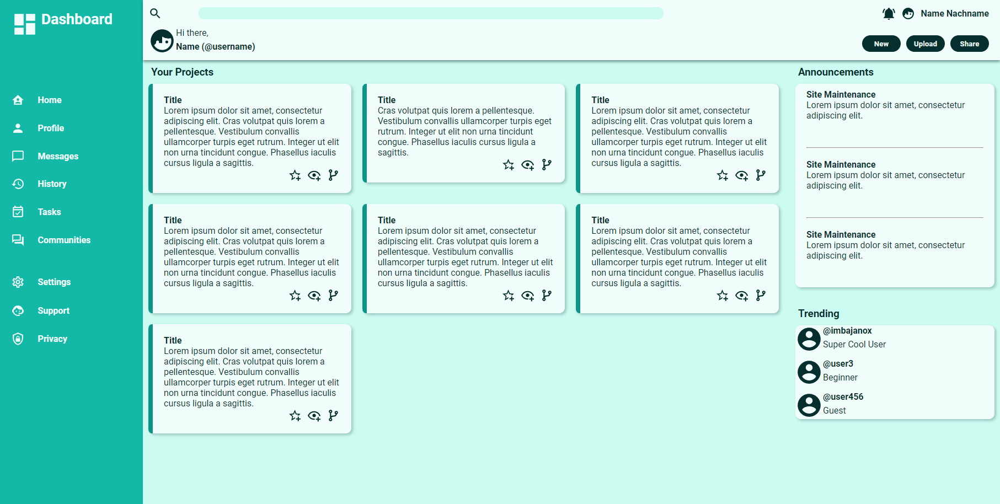

# Admin-Dashboard

An Admin Dashboard design with HTML and CSS. The Goal of this Project is it to sharpen existing HTML and CSS skills and learn new skills along the Project.
At the moment this is only a visual design project. There is no functionality involved.

## Live View

You can view the Page [here](https://imbajanox.github.io/Admin-Dashboard/)

## Features

- Grid-Based design
- Material Design Icons from [Pictogrammers](https://pictogrammers.com/library/mdi/) used with [Iconify](https://iconify.design/)
- Navigation Bar
- Semi-Responsive Content Tiles
- Searchbar 
- Action-Buttons
- "Greeting"-Section
- Announcements
- Trending

## Possible future Features

- Responsive design for mobile devices

## Preview

